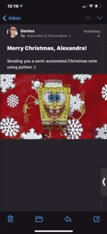

# Christmas E-mail 

`ChristmasMail.py` uses (hidden) email account credentials to send an email with the recipient's first name in the subject line. the script returns a print confirming the result of the email sending attempt (success or failure). 

Please note:
* the first name is derived from the email string; first name is presumed to be text prior to the period. This wouldnt be meaningful for addresses without a period. * to scale this, recommend using list of names and email recipients. 
* Also recommend embedding the gif explicitly as opposed to attaching (for this postcard-like email). 

The resulting email:

